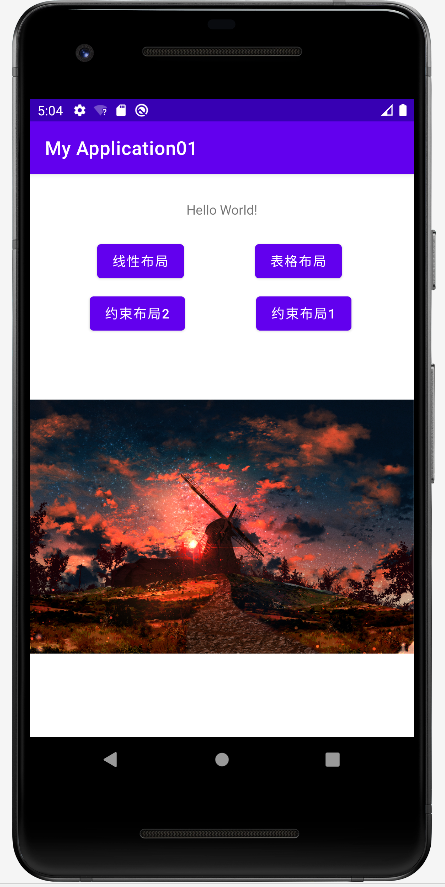
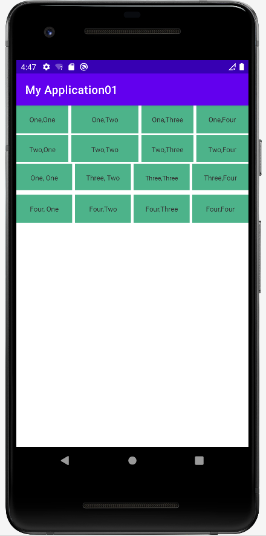
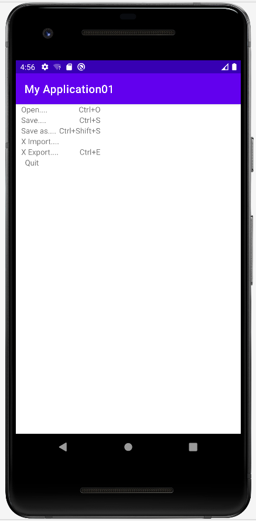
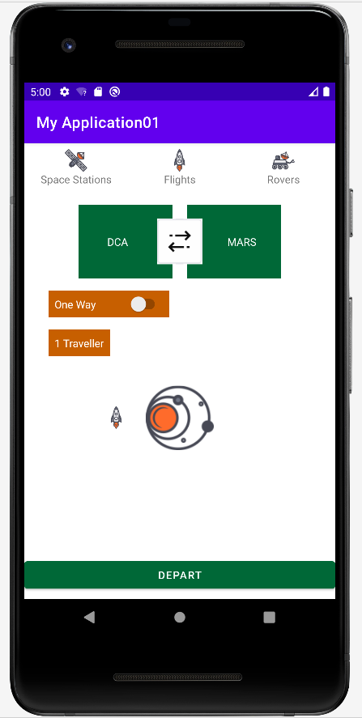

# Android界面布局实验
- [Android界面布局实验](#android界面布局实验)
  - [1.activity_main.xml](#1activity_mainxml)
    - [(1)部分实验代码](#1部分实验代码)
    - [(2)实验结果如下图](#2实验结果如下图)
  - [2.Android布局实验——线性布局(layout01.xml)](#2android布局实验线性布局layout01xml)
    - [(1)部分实验代码](#1部分实验代码-1)
    - [(2)实验结果如下图](#2实验结果如下图-1)
  - [3.Android布局实验——表格布局(layout02.xml)](#3android布局实验表格布局layout02xml)
    - [(1)部分实验代码](#1部分实验代码-2)
    - [(2)实验结果如下图](#2实验结果如下图-2)
  - [4.Android布局实验——约束布局1(layout04.xml)](#4android布局实验约束布局1layout04xml)
    - [(1)部分实验代码](#1部分实验代码-3)
    - [(2)实验结果如下图](#2实验结果如下图-3)
  - [5.Android布局实验——约束布局2(layout05.xml)](#5android布局实验约束布局2layout05xml)
    - [(1)部分实验代码](#1部分实验代码-4)
    - [(2)实验结果如下图](#2实验结果如下图-4)
  - [6.自定义按钮跳转页面事件](#6自定义按钮跳转页面事件)
    - [(1)部分实验代码](#1部分实验代码-5)

## 1.activity_main.xml
### (1)部分实验代码
    <TextView
        android:id="@+id/textView2"
        android:layout_width="wrap_content"
        android:layout_height="wrap_content"
        android:text="Hello World!"
        app:layout_constraintBottom_toBottomOf="parent"
        app:layout_constraintEnd_toEndOf="parent"
        app:layout_constraintStart_toStartOf="parent"
        app:layout_constraintTop_toTopOf="parent"
        app:layout_constraintVertical_bias="0.049" />

    <Button
        android:id="@+id/btn01"
        android:layout_width="wrap_content"
        android:layout_height="wrap_content"
        android:layout_marginStart="72dp"
        android:text="@string/txt_linear"
        app:layout_constraintStart_toStartOf="parent"
        app:layout_constraintTop_toTopOf="@+id/guideline4"
        tools:ignore="MissingConstraints" />
### (2)实验结果如下图

## 2.Android布局实验——线性布局(layout01.xml)
### (1)部分实验代码
    <LinearLayout
        android:layout_width="match_parent"
        android:layout_height="50dp"
        android:orientation="horizontal"
        >

        <TextView
            android:layout_width="0dp"
            android:layout_height="50dp"
            android:layout_weight="1"
            android:text="One,One"
            android:background="#4DB38A"
            android:textColor="#333333"
            android:textSize="12dp"
            android:gravity="center"
            />
        <TextView
            android:layout_width="0dp"
            android:layout_height="50dp"
            android:layout_weight="1.3"
            android:layout_marginLeft="5dp"
            android:text="One,Two"
            android:background="#4DB38A"
            android:textColor="#333333"
            android:textSize="12dp"
            android:gravity="center"/>
        <TextView
            android:layout_width="0dp"$$
            android:layout_height="50dp"
            android:layout_marginLeft="5dp"
            android:layout_weight="1"
            android:text="One,Three"
            android:background="#4DB38A"
            android:textColor="#333333"
            android:textSize="12dp"
            android:gravity="center"/>
        <TextView
            android:layout_width="0dp"
            android:layout_height="50dp"
            android:layout_weight="1"
            android:layout_marginLeft="5dp"
            android:text="One,Four"
            android:background="#4DB38A"
            android:textColor="#333333"
            android:textSize="12dp"
            android:gravity="center"/>
    </LinearLayout>
### (2)实验结果如下图

## 3.Android布局实验——表格布局(layout02.xml)
### (1)部分实验代码
    <TableRow>
        <TextView
            android:text="Open...."
            android:paddingLeft="10dp"/>
        <TextView
            android:text="Ctrl+O"
            android:gravity="right"
            android:paddingRight="10dp"/>
    </TableRow>
    <TableRow>
        <TextView
            android:text="Save...."
            android:paddingLeft="10dp"/>
        <TextView
            android:text="Ctrl+S"
            android:gravity="right"
            android:paddingRight="10dp"/>
    </TableRow>
    <TableRow>
        <TextView
            android:text="Save as...."
            android:paddingLeft="10dp"/>
        <TextView
            android:text="Ctrl+Shift+S"
            android:gravity="right"
            android:paddingRight="10dp"/>
    </TableRow>
    <TableRow>
        <TextView
            android:text="X Import...."
            android:paddingLeft="10dp"/>
    </TableRow>
    <TableRow>
        <TextView
            android:text="X Export...."
            android:paddingLeft="10dp"/>
        <TextView
            android:text="Ctrl+E"
            android:gravity="right"
            android:paddingRight="10dp"/>
    </TableRow>
    <TableRow>
        <TextView
            android:text="  Quit"
            android:paddingLeft="10dp"/>
    </TableRow>
### (2)实验结果如下图

## 4.Android布局实验——约束布局1(layout04.xml)
### (1)部分实验代码
    <androidx.constraintlayout.widget.Guideline
        android:id="@+id/guideline2"
        android:layout_width="wrap_content"
        android:layout_height="wrap_content"
        android:orientation="horizontal"
        app:layout_constraintGuide_end="605dp" />

    <androidx.constraintlayout.widget.Guideline
        android:id="@+id/guideline3"
        android:layout_width="wrap_content"
        android:layout_height="wrap_content"
        android:orientation="horizontal"
        app:layout_constraintGuide_begin="553dp" />

    <Button
        android:id="@+id/button5"
        android:layout_width="wrap_content"
        android:layout_height="wrap_content"
        android:layout_marginBottom="50dp"
        android:text="0"
        android:textSize="24sp"
        app:layout_constraintBottom_toTopOf="@+id/guideline3"
        app:layout_constraintEnd_toStartOf="@+id/button6"
        app:layout_constraintHorizontal_bias="0.5"
        app:layout_constraintStart_toStartOf="parent" />

    <Button
        android:id="@+id/button6"
        android:layout_width="wrap_content"
        android:layout_height="wrap_content"
        android:text="."
        android:textSize="24sp"
        app:layout_constraintBottom_toBottomOf="@+id/button5"
        app:layout_constraintEnd_toStartOf="@+id/button7"
        app:layout_constraintHorizontal_bias="0.5"
        app:layout_constraintStart_toEndOf="@+id/button5"
        app:layout_constraintTop_toTopOf="@+id/button5" />
### (2)实验结果如下图

## 5.Android布局实验——约束布局2(layout05.xml)
### (1)部分实验代码
    <LinearLayout
            android:layout_width="0dp"
            android:layout_height="wrap_content"
            android:layout_weight="1"
            android:gravity="center"
            android:orientation="vertical">

            <ImageView
                android:id="@+id/spaceStationIcon"
                android:layout_width="30dp"
                android:layout_height="30dp"
                android:src="@drawable/space_station_icon" />

            <TextView
                android:id="@+id/spaceStationLabel"
                android:layout_width="wrap_content"
                android:layout_height="wrap_content"
                android:text="@string/space_stations" />

        </LinearLayout>

        <LinearLayout
            android:layout_width="0dp"
            android:layout_height="wrap_content"
            android:layout_weight="1"
            android:gravity="center"
            android:orientation="vertical">

            <ImageView
                android:id="@+id/flightsIcon"
                android:layout_width="30dp"
                android:layout_height="30dp"
                android:src="@drawable/rocket_icon" />

            <TextView
                android:id="@+id/flightsLabel"
                android:layout_width="wrap_content"
                android:layout_height="wrap_content"
                android:text="@string/flights" />

        </LinearLayout>

        <LinearLayout
            android:layout_width="0dp"
            android:layout_height="wrap_content"
            android:layout_weight="1"
            android:gravity="center"
            android:orientation="vertical">

            <ImageView
                android:id="@+id/roverIcon"
                android:layout_width="30dp"
                android:layout_height="30dp"
                android:src="@drawable/rover_icon" />

            <TextView
                android:id="@+id/roverLabel"
                android:layout_width="wrap_content"
                android:layout_height="wrap_content"
                android:text="@string/rovers" />
        </LinearLayout>
### (2)实验结果如下图

## 6.自定义按钮跳转页面事件
### (1)部分实验代码
创建java类

    public class layout01Activity extends AppCompatActivity implements View.OnClickListener{

    Button btn01;

    @Override
    protected void onCreate(@Nullable Bundle savedInstanceState) {
        super.onCreate(savedInstanceState);
        setContentView(R.layout.layout01);
    }

    @Override
    public void onClick(View view) {

    }
    }

注册

    <application
        android:allowBackup="true"
        android:dataExtractionRules="@xml/data_extraction_rules"
        android:fullBackupContent="@xml/backup_rules"
        android:icon="@mipmap/ic_launcher"
        android:label="@string/app_name"
        android:roundIcon="@mipmap/ic_launcher_round"
        android:supportsRtl="true"
        android:theme="@style/Theme.MyApplication01"
        tools:targetApi="31">
        <activity
            android:name=".MainActivity"
            android:exported="true">
            <intent-filter>
                <action android:name="android.intent.action.MAIN" />

                <category android:name="android.intent.category.LAUNCHER" />
            </intent-filter>
        </activity>
        <activity android:name=".layout01Activity"></activity>
        <activity android:name=".layout02Activity"></activity>
        <activity android:name=".layout03Activity"></activity>
        <activity android:name=".layout04Activity"></activity>
        <activity android:name=".layout05Acticity"></activity>
    </application>

重写方法

    @Override
    protected void onCreate(Bundle savedInstanceState) {
        super.onCreate(savedInstanceState);
        setContentView(R.layout.activity_main);

        btn01 = (Button) findViewById(R.id.btn01);
        btn02 = (Button) findViewById(R.id.btn02);
        btn03 = (Button) findViewById(R.id.btn03);
        btn04 = (Button) findViewById(R.id.btn04);

        btn01.setOnClickListener(new View.OnClickListener() {
            @Override
            public void onClick(View view) {
                Intent intent = new Intent(MainActivity.this, layout01Activity.class);
                startActivity(intent);
            }
        });

        btn02.setOnClickListener(new View.OnClickListener() {
            @Override
            public void onClick(View view) {
                Intent intent = new Intent(MainActivity.this, layout02Activity.class);
                startActivity(intent);
            }
        });

        btn03.setOnClickListener(new View.OnClickListener() {
            @Override
            public void onClick(View view) {
                Intent intent = new Intent(MainActivity.this, layout04Activity.class);
                startActivity(intent);
            }
        });

        btn04.setOnClickListener(new View.OnClickListener() {
            @Override
            public void onClick(View view) {
                Intent intent = new Intent(MainActivity.this, layout05Acticity.class);
                startActivity(intent);
            }
        });

    }